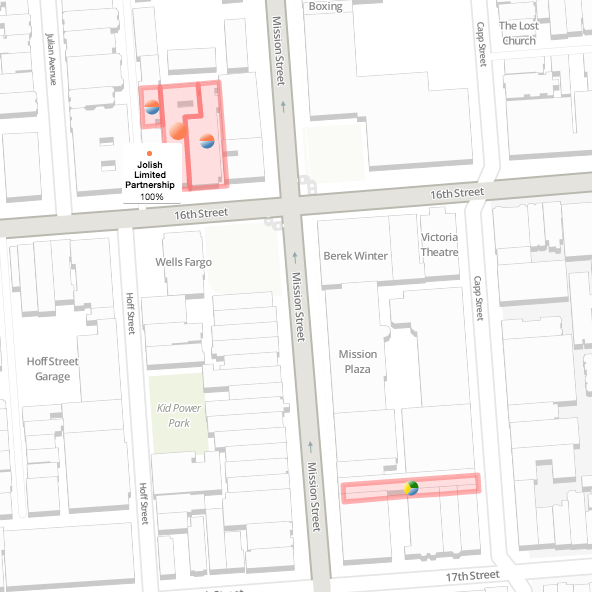

# Jolish Family Properties
### http://radcliff.github.io/jolish-family-properties/

  
*San Francisco, California*

Parcels outlined in red are owned by the Jolish family and their business partners. Hover on a parcel to see its address. A pie chart for each parcel represents ownership stake for each parcel. Each ownership entity is reprsented by a unique color. Hover on a pie slice to see the ownership entity and the percentage ownership stake of the parcel owned. A pie chart with only one color represents a parcel that is wholy owned by one ownership entity.

*Data: San Francisco Office of Assessor-Recorder, Open Street Map*

## Technologies Used
- Leaflet.js
- Leaflet Data Visualization Framework
- TileMill
- TileSteam
- Quantum GIS
